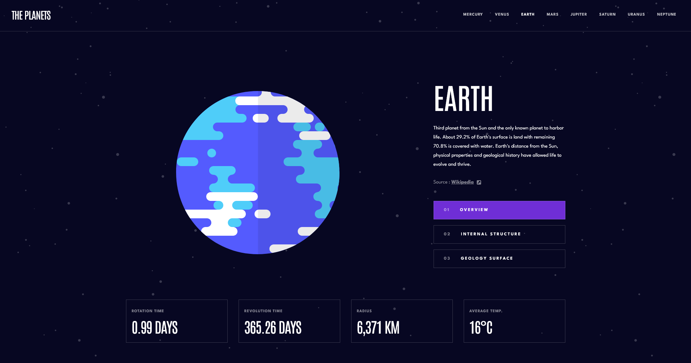
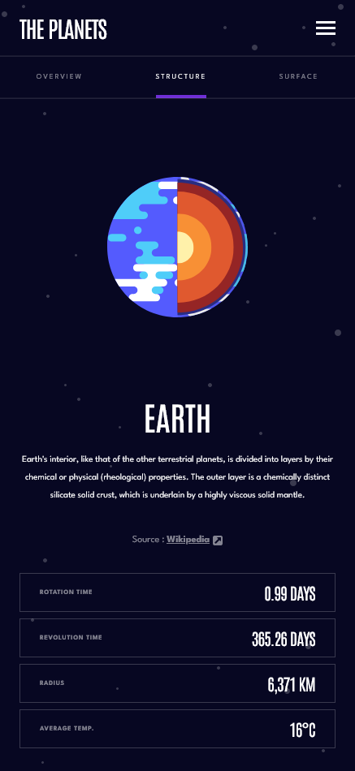

# Frontend Mentor - Planets Fact Site Solution

This is a solution to the [Planets fact site challenge on Frontend Mentor](https://www.frontendmentor.io/challenges/planets-fact-site-gazqN8w_f).

## Table of contents

- [Overview](#overview)
  - [The challenge](#the-challenge)
  - [Screenshot](#screenshot)
  - [Links](#links)
- [My process](#my-process)
  - [Built with](#built-with)
  - [What I learned](#what-i-learned)
  - [Continued development](#continued-development)
- [Author](#author)

## Overview

### The challenge

Users should be able to:

- View the optimal layout for the app depending on their device's screen size.
- See hover states for all interactive elements on the page.
- View each planet page and toggle between "Overview", "Internal Structure", and "Surface Geology".

### Screenshot

### Links

- Solution URL: [GitHub](https://github.com/wesleyjacoby/Planet-Fact-Site)
- Live Site URL: [GitHub Pages](https://wesleyjacoby.github.io/Planet-Fact-Site/)

## My process

### Built with

- Semantic HTML5 Markup
- CSS Custom Properties
- Flexbox
- Mobile-first workflow
- [Vue.js](https://vuejs.org/) - JS Framework

### What I learned

This project really pushed me, but I really had a lot of fun with it.

The hardest part was getting the different components and views to comminucate and pass information between each other. Once I got the hang of that, the rest of the project went fairly quickly.

All data is being pulled from a JSON file, so the code is very modular.

### Continued development

I'm getting more comfortable with Vue. There's still so much to learn and do though.

## Author

- Frontend Mentor - [@wesleyjacoby](https://www.frontendmentor.io/profile/wesleyjacoby)